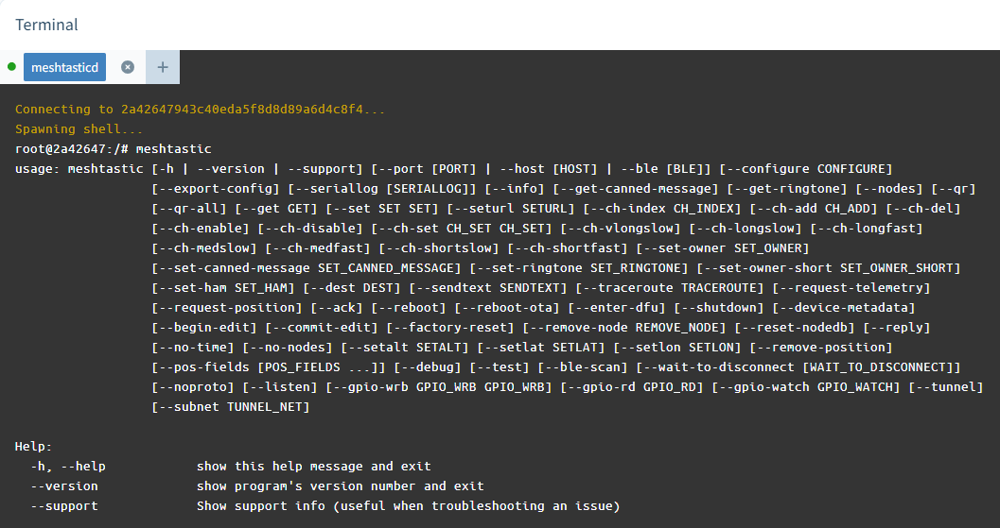

# <kbd></kbd> <kbd></kbd> balena-meshtasticd
Meshtastic Linux Native Application with Charlie Unicorn magic on your PiZero W 2! 

> [!CAUTION]
> # :rotating_light:
> **Under no circumstances** should a LoRa radio be powered on without a properly connected antenna. Doing so poses a significant risk of irreparable damage to the radio module.
>
> A LoRa radio operates by transmitting and receiving radio waves through an antenna. When an antenna is not connected, the radio's transmitted energy has nowhere to dissipate. This causes a buildup of electrical energy within the radio module, which can lead to component failure, overheating, and permanent damage.
>
> ***To ensure the longevity and proper function of your LoRa radio, always verify that the antenna is securely attached before powering on the device.***

## :wrench: Hardware
_balena-meshtastic_ has been tested with the following devices:

***LoRa:***
* [Waveshare - SX1262 868/915M LoRaWAN/GNSS HAT - SKU: 24654](https://www.waveshare.com/sx1262-lorawan-hat.htm?sku=24654)
* [Adafruit - RFM95W LoRa Radio Transceiver Breakout - 868 or 915 MHz - SKU: 3072](https://www.adafruit.com/product/3072)

***SBC:***
* [Raspberry Pi Zero 2 W](https://www.raspberrypi.com/products/raspberry-pi-zero-2-w/)
* [Raspberry Pi 3 Model B+](https://www.raspberrypi.com/products/raspberry-pi-3-model-b-plus/)

## :gear: Initial Device Configuration
> [!TIP]
> The Meshtastic Python CLI is installed by default. You can access it via the Terminal in the BalenaCloud dashboard.
>
> 

### :point_up: First things...
The minimal setup required is to set the region and preset. _You can chain the flags and settings on one line. exempli gratia,_ 
`meshtastic --set lora.region US --set lora.modem_preset LONG_FAST` 

|Setting|Usage|Description|
|--|--|--|
| --set lora.region | `meshtastic --set lora.region UNSET` | [LoRa Region Configuration Options](https://meshtastic.org/docs/configuration/radio/lora/) |
| --set lora.modem_preset | `meshtastic --set lora.modem_preset` | [LoRa modem presets](https://meshtastic.org/docs/configuration/radio/lora/#modem-preset) |
| --seturl | `meshtastic --seturl https://www.meshtastic.org/c/GAMiIE67C6zsNmlWQ-KE1tKt0fRKFciHka-DShI6G7ElvGOiKgZzaGFyZWQ=` | Set the channel URL, which contains LoRa configuration plus the configuration of channels. Replaces your current configuration and channels completely. |

### :zap: _Enjoy!_  
 //Sam